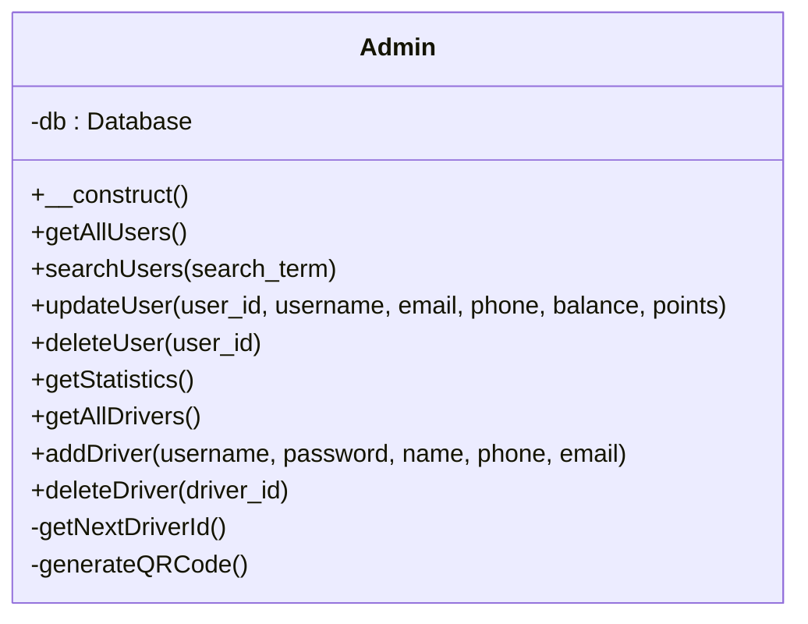
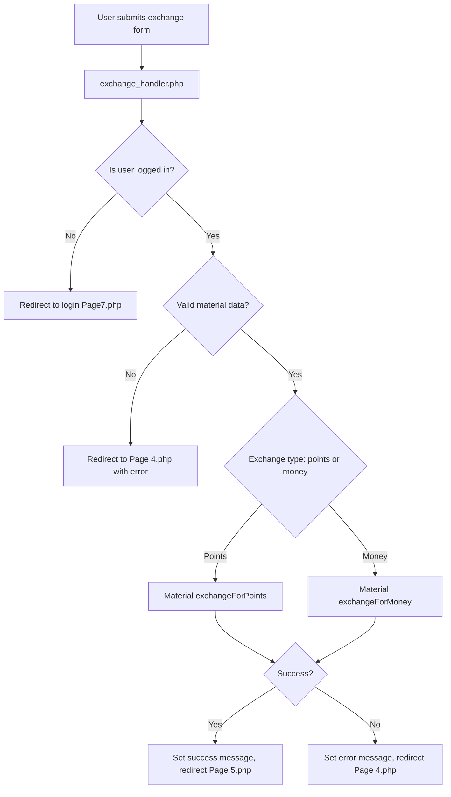
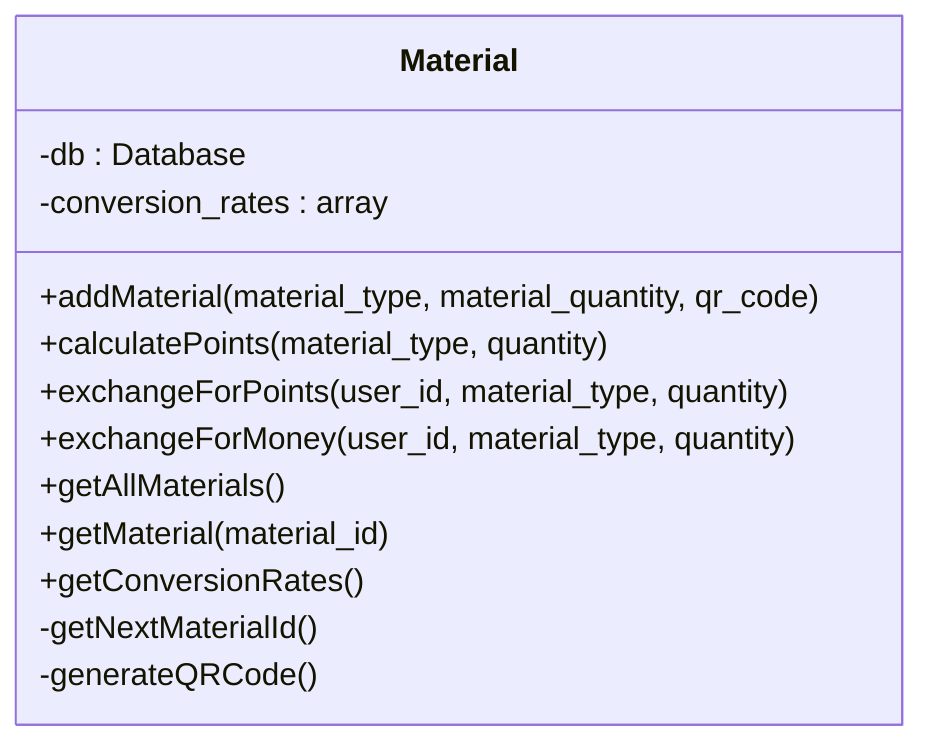
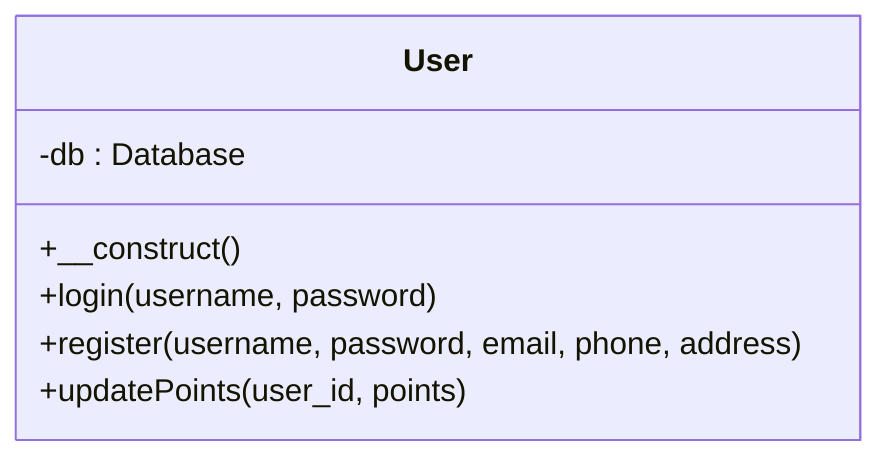

# Documentation for خردة (Khurda) Application Codebase

This documentation describes each PHP and infrastructure file in your recycling/points web application. It includes explanations, flowcharts, class diagrams, and API blocks where relevant.

---

## add_points.php

This API endpoint allows a logged-in user to add points to their account. It requires authentication and expects a JSON payload specifying the number of points to add.

**Features:**
- Verifies user is logged in (via `$_SESSION['user_id']`)
- Accepts points to add via JSON POST
- Updates user points accordingly
- Returns JSON response

### Add Points API Endpoint

```api
{
    "title": "Add Points",
    "description": "Add points to the currently logged-in user's account.",
    "method": "POST",
    "baseUrl": "https://yourdomain.com",
    "endpoint": "/add_points.php",
    "headers": [
        {
            "key": "Content-Type",
            "value": "application/json",
            "required": true
        }
    ],
    "bodyType": "json",
    "requestBody": "{\n  \"points\": 100\n}",
    "responses": {
        "200": {
            "description": "Points added successfully",
            "body": "{\n  \"success\": true,\n  \"points\": 200\n}"
        },
        "400": {
            "description": "Invalid points or not logged in",
            "body": "{\n  \"success\": false,\n  \"message\": \"يجب تسجيل الدخول\"\n}"
        }
    }
}
```

---

## finish_goal.php

This script is used to finish a recycling "goal" (e.g., collecting a specific number of bottles) and award points to the user.

**Features:**
- Validates user session and goal existence
- Adds goal points to user
- Removes goal from session
- Returns JSON result

### Finish Goal API Endpoint

```api
{
    "title": "Finish Goal",
    "description": "Mark the current recycling goal as complete and add points to the user.",
    "method": "POST",
    "baseUrl": "https://yourdomain.com",
    "endpoint": "/finish_goal.php",
    "headers": [
        {
            "key": "Content-Type",
            "value": "application/json",
            "required": false
        }
    ],
    "bodyType": "none",
    "responses": {
        "200": {
            "description": "Goal finished, points awarded",
            "body": "{ \"success\": true }"
        },
        "400": {
            "description": "Goal not found or invalid session",
            "body": "{ \"success\": false, \"message\": \"الجلسة غير صالحة\" }"
        }
    }
}
```

---

## index.php

A simple entry point that includes the home page. This helps in keeping the main application landing at `home.php`.

```php
<?php require_once __DIR__ . '/home.php'; 
```

---

## Admin.php

This file defines the `Admin` class, which encapsulates admin functionality for the application.

### Major Features:
- List/search/update/delete users
- Get statistics (users, points, balances, materials)
- Manage drivers (add, list, delete)

### Admin Class Diagram



### Notable Methods

- **getAllUsers()**: Fetches all users ordered by latest.
- **searchUsers($term)**: Searches by username or email.
- **updateUser(...)**: Updates a user's profile, balance, and points.
- **deleteUser($id)**: Removes a user.
- **getStatistics()**: Returns total users, points, balances, and materials.
- **getAllDrivers()/addDriver()/deleteDriver()**: Manage drivers for material pickup.

---

## dashboard_backend.php

Acts as a backend controller for AJAX requests from the admin dashboard. Handles user management and statistics.

**Features:**
- POST: update/delete/search user
- GET: fetch all users/statistics
- Returns JSON responses

### API Endpoints

#### Update User

```api
{
    "title": "Update User",
    "description": "Update a specific user's information as admin.",
    "method": "POST",
    "baseUrl": "https://yourdomain.com",
    "endpoint": "/dashboard_backend.php",
    "headers": [],
    "formData": [
        { "key": "action", "value": "update_user", "required": true },
        { "key": "user_id", "value": "User ID", "required": true },
        { "key": "username", "value": "New username", "required": true },
        { "key": "email", "value": "New email", "required": true },
        { "key": "phone", "value": "Phone", "required": false },
        { "key": "balance", "value": "Balance", "required": false },
        { "key": "points", "value": "Points", "required": false }
    ],
    "bodyType": "form",
    "responses": {
        "200": {
            "description": "Update successful",
            "body": "{ \"success\": true, \"message\": \"تم تحديث المستخدم بنجاح\" }"
        }
    }
}
```

#### Delete User

```api
{
    "title": "Delete User",
    "description": "Delete a user from the system.",
    "method": "POST",
    "baseUrl": "https://yourdomain.com",
    "endpoint": "/dashboard_backend.php",
    "headers": [],
    "formData": [
        { "key": "action", "value": "delete_user", "required": true },
        { "key": "user_id", "value": "User ID", "required": true }
    ],
    "bodyType": "form",
    "responses": {
        "200": {
            "description": "User deleted",
            "body": "{ \"success\": true, \"message\": \"تم حذف المستخدم بنجاح\" }"
        }
    }
}
```

#### Search Users

```api
{
    "title": "Search Users",
    "description": "Search users by username or email.",
    "method": "POST",
    "baseUrl": "https://yourdomain.com",
    "endpoint": "/dashboard_backend.php",
    "headers": [],
    "formData": [
        { "key": "action", "value": "search_users", "required": true },
        { "key": "search_term", "value": "Search term", "required": true }
    ],
    "bodyType": "form",
    "responses": {
        "200": {
            "description": "Users found",
            "body": "{ \"success\": true, \"users\": [...] }"
        }
    }
}
```

#### Get All Users

```api
{
    "title": "Get All Users",
    "description": "Fetch all users for admin dashboard.",
    "method": "GET",
    "baseUrl": "https://yourdomain.com",
    "endpoint": "/dashboard_backend.php?action=get_all_users",
    "headers": [],
    "bodyType": "none",
    "responses": {
        "200": {
            "description": "Users list",
            "body": "{ \"success\": true, \"users\": [...] }"
        }
    }
}
```

#### Get Statistics

```api
{
    "title": "Get Statistics",
    "description": "Get dashboard statistics (users, points, balance, materials).",
    "method": "GET",
    "baseUrl": "https://yourdomain.com",
    "endpoint": "/dashboard_backend.php?action=get_statistics",
    "headers": [],
    "bodyType": "none",
    "responses": {
        "200": {
            "description": "Statistics",
            "body": "{ \"success\": true, \"statistics\": { \"total_users\": 100, \"total_points\": 5000, ... } }"
        }
    }
}
```

---

## Dockerfile

Defines the Docker image for deploying the PHP application.

**Key Steps:**
- Uses PHP 8.2 with Apache
- Installs PostgreSQL extensions
- Copies app files to `/var/www/html`
- Ensures correct permissions

```Dockerfile
FROM php:8.2-apache
RUN apt-get update && apt-get install -y \
  libpq-dev \
  && docker-php-ext-install pdo_pgsql pgsql \
  && apt-get clean \
  && rm -rf /var/lib/apt/lists/*
COPY . /var/www/html
RUN chown -R www-data:www-data /var/www/html
```

---

## exchange_handler.php

Handles the process where users exchange recyclable materials for points or money.

**Features:**
- Requires authentication
- Accepts POST with `material_type`, `quantity`, `exchange_type`
- Validates input
- Processes exchange via `Material` class
- Sets success/error messages in session and redirects

### High-level Exchange Flow



---

## config.php

Central configuration and utility file.

**Main Contents:**
- Database connection via PDO to PostgreSQL (using `DATABASE_URL`)
- Helper functions: `isLoggedIn`, `redirect`, `sanitize`

### Database Connection

Creates a `Database` object for PDO access and query execution. Connection details are parsed from the `DATABASE_URL` environment variable.

---

## Dashboard.php

The admin dashboard UI.

**Description:**
- Loads user and statistics data from `dashboard_backend.php`
- Displays statistics and all users in a table
- Supports search/filter, edit, and delete operations via AJAX

---

## home.php

Main home/landing page for the site.

**Features:**
- Shows main offer (exchange scrap for points/money)
- Large hero section, features, and call-to-action buttons
- Navigation bar included

---

## login_handler.php

Handles POST login requests.

**Features:**
- Validates input
- Uses the `User` class to authenticate
- On success: redirects to home
- On failure: sets error and redirects to login

### Login API

```api
{
    "title": "User Login",
    "description": "Authenticate user and start session.",
    "method": "POST",
    "baseUrl": "https://yourdomain.com",
    "endpoint": "/login_handler.php",
    "headers": [
        { "key": "Content-Type", "value": "application/x-www-form-urlencoded", "required": true }
    ],
    "formData": [
        { "key": "username", "value": "User's username", "required": true },
        { "key": "password", "value": "User's password", "required": true }
    ],
    "bodyType": "form",
    "responses": {
        "302": {
            "description": "Redirect on success or failure"
        }
    }
}
```

---

## logout.php

Logs out the user by destroying the session and redirecting to index.

---

## Navbar.php

Reusable navigation bar component.

**Features:**
- Shows links to major pages
- Displays user info and points if logged in
- Login/Register and Logout buttons

---

## Material.php

Defines the `Material` class, which manages recyclable materials and exchanges.

### Main Features:
- Add material record (with optional QR code)
- Calculate points from material and quantity
- Exchange material for points or money
- List materials

### Conversion Rates Table

| Material     | Pieces/Set | Points/Set |
|--------------|------------|------------|
| plastic      | 20         | 100        |
| glass        | 20         | 100        |
| metal        | 20         | 700        |
| electronics  | 20         | 100        |

### Material Class Diagram



---

## Page 3.php

Displays the available material types for exchange, with a focus on electronics, cans, and plastic. Only plastic exchange is enabled and links to Page 4.

---

## Page 2.php

Shows the various recycling services (glass, plastic, cans, electronics) and their rates. Only plastic exchange is available.

---

## Nav Register.php

A minimal navigation bar for authentication pages, offering quick access to register or login.

---

## Page 5.php

Goal tracking page, allowing the user to increment a counter as they recycle bottles and complete a goal.

**Features:**
- Displays recycling goal and progress
- Button to finish and claim points (triggers `finish_goal.php`)

---

## Page6.php

Registration page for creating a new user account.

**Features:**
- Registration form with username, email, phone, address, and password
- Shows success/error messages from session
- POSTs to `register_handler.php`

---

## Page 4.php

Details about plastic recycling and goal creation.

**Features:**
- Shows info about plastic recycling
- Allows user to set a goal (# bottles)
- Calculates points in real-time
- POSTs to `set_goal.php` via JavaScript

---

## Page7.php

Login page for users.

**Features:**
- Simple login form (username, password)
- Form submits to `login_handler.php`

---

## register_handler.php

Handles registration form submissions.

**Features:**
- Validates input
- Registers user with `User` class
- Sets success/error in session
- Redirects to login or registration form based on result

---

## set_goal.php

API endpoint to set a recycling goal for the user.

**Features:**
- Requires authentication
- Expects JSON input with `bottles` and `points`
- Stores goal in user session
- Returns JSON success

### Set Goal API

```api
{
    "title": "Set Recycling Goal",
    "description": "Set a new goal (number of bottles and corresponding points) for the logged-in user.",
    "method": "POST",
    "baseUrl": "https://yourdomain.com",
    "endpoint": "/set_goal.php",
    "headers": [
        { "key": "Content-Type", "value": "application/json", "required": true }
    ],
    "bodyType": "json",
    "requestBody": "{ \"bottles\": 40, \"points\": 200 }",
    "responses": {
        "200": {
            "description": "Goal set successfully",
            "body": "{ \"success\": true }"
        },
        "400": {
            "description": "Not logged in",
            "body": "{ \"success\": false, \"message\": \"يجب تسجيل الدخول\" }"
        }
    }
}
```

---

## redeem.php

API endpoint to redeem points for either money or other rewards.

**Features:**
- Requires authentication
- Expects JSON with `type` (points/money) and `amount`
- Validates points and balance
- Updates user points/balance accordingly
- Returns JSON with updated values

### Redeem API

```api
{
    "title": "Redeem Points",
    "description": "Redeem user points for rewards or money.",
    "method": "POST",
    "baseUrl": "https://yourdomain.com",
    "endpoint": "/redeem.php",
    "headers": [
        { "key": "Content-Type", "value": "application/json", "required": true }
    ],
    "bodyType": "json",
    "requestBody": "{ \"type\": \"money\", \"amount\": 200 }",
    "responses": {
        "200": {
            "description": "Redemption successful, returns new points/balance",
            "body": "{ \"success\": true, \"points\": 500, \"balance\": 40 }"
        },
        "400": {
            "description": "Invalid or insufficient points",
            "body": "{ \"success\": false, \"message\": \"نقاطك غير كافية\" }"
        }
    }
}
```

---

## User.php

Defines the `User` class for user authentication, registration, and updating points.

### Main Methods

- **login($username, $password)**: Authenticates user and sets session.
- **register($username, $password, $email, $phone, $address)**: Registers new user, generates QR code.
- **updatePoints($user_id, $points)**: Updates user's points and session.

### User Class Diagram



---

## reset_db.php

**Utility script to reset the database.**

- Deletes all users and serial numbers from the PostgreSQL database.
- Intended for development/testing only.

```php
<?php
require_once 'config.php';
$db = new Database();
$db->query("DELETE FROM user_information");
$db->query("DELETE FROM serial_number");
echo "DB RESET DONE";
```

---

```card
{
  "title": "Security Notice",
  "content": "Plain-text password handling in the current User class is insecure. Implement password hashing for all authentication and storage."
}
```
---

```card
{
  "title": "Session-Based APIs",
  "content": "Most endpoints rely on PHP sessions for authentication. Ensure session security and HTTPS for all API access."
}
```
---

This documentation covers all files, their purpose, endpoints, and class relationships. For further improvements, consider implementing proper password hashing and more robust error handling.
