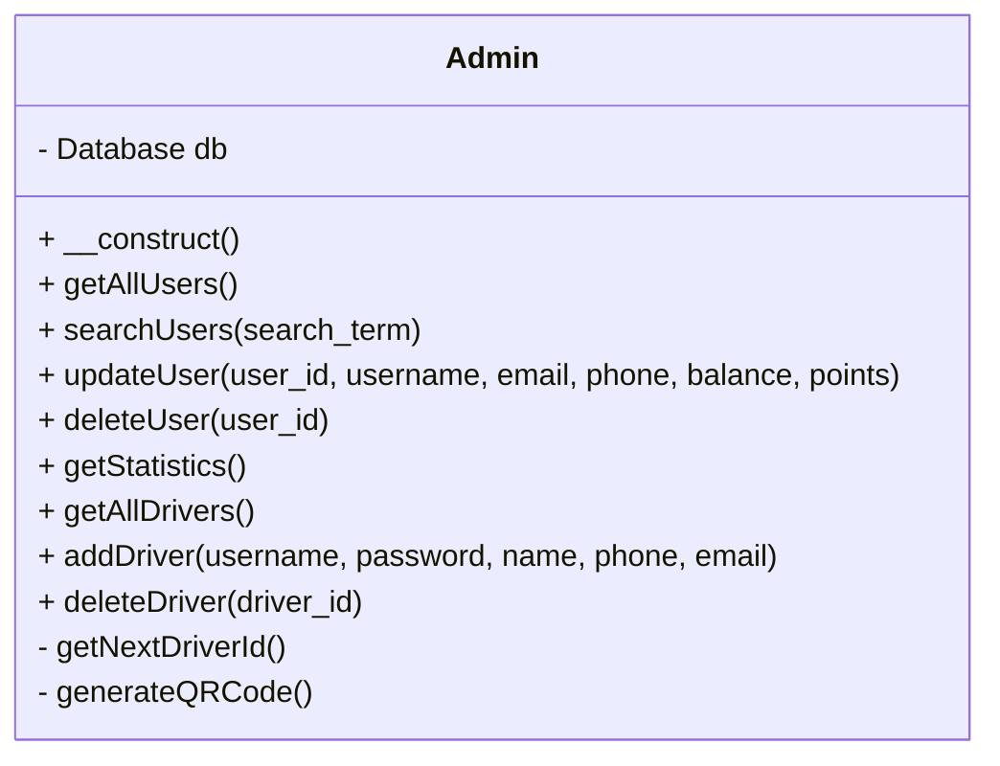
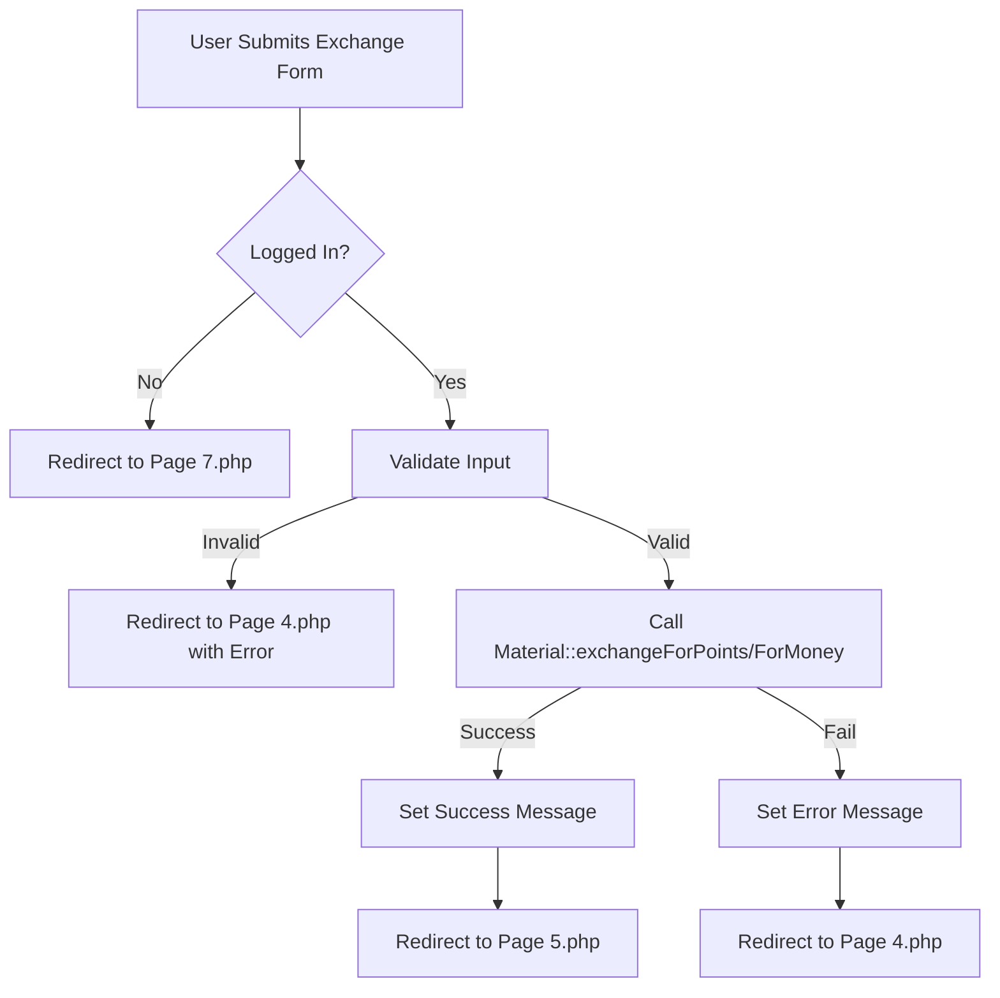
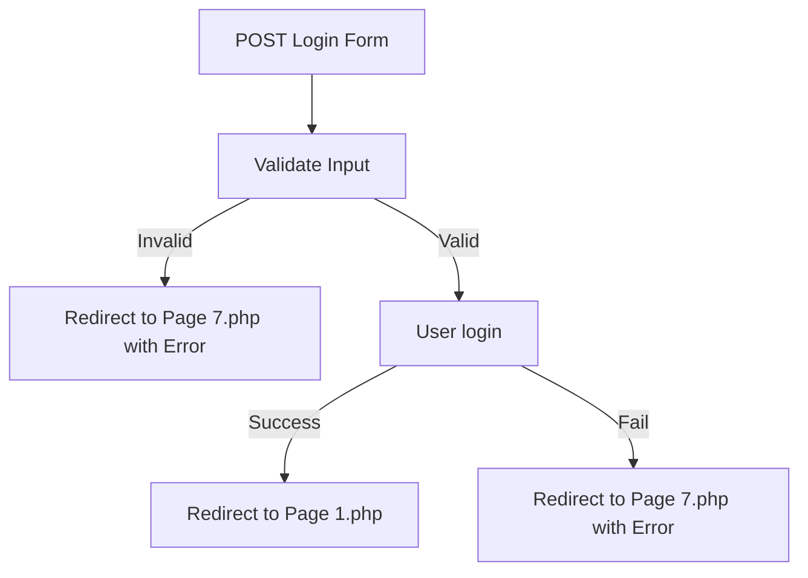
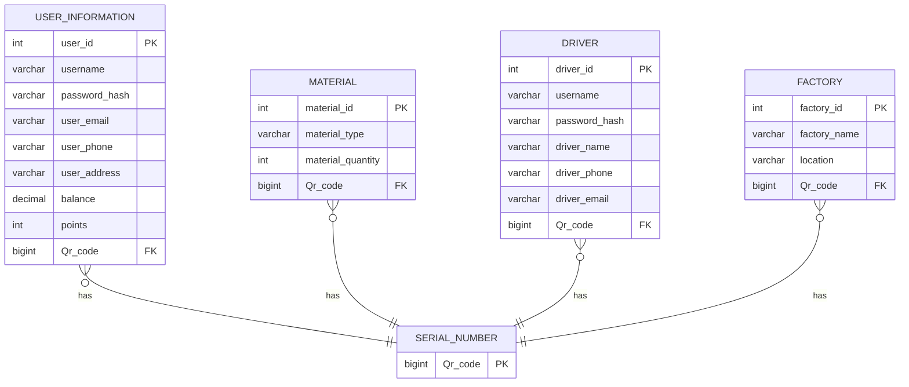

# Admin.php

This file implements the **Admin** class, which provides all administrative actions for managing users, drivers, and basic statistics for the system. It interacts with the database using the `Database` class.

## Main Functions Provided

| Method                   | Purpose                                                    |
| ------------------------ | ---------------------------------------------------------- |
| getAllUsers()            | Retrieves all users.                                       |
| searchUsers($term)       | Searches users by username or email.                       |
| updateUser(...)          | Updates user details and returns a status.                 |
| deleteUser($user_id)     | Deletes a user.                                            |
| getStatistics()          | Returns summary statistics (users, points, balance, etc.). |
| getAllDrivers()          | Retrieves all drivers.                                     |
| addDriver(...)           | Adds a new driver with a QR code.                          |
| deleteDriver($driver_id) | Deletes a driver.                                          |

### Example: Get All Users

```php
$admin = new Admin();
$users = $admin->getAllUsers();
```

### Example: Update a User

```php
$result = $admin->updateUser(1, 'username', 'email@example.com', '0123456', 100.0, 200);
if ($result['success']) {
    // success logic
}
```

### Statistics Overview

- **Total Users:** Count from `user_information`
- **Total Points:** Sum from `user_information.points`
- **Total Balance:** Sum from `user_information.balance`
- **Total Materials:** Count from `material`

### Driver Management

Drivers are managed with unique usernames and QR codes. When a driver is added, a QR code is generated and stored in both `serial_number` and driver's table.

---

## Admin Class Structure



---

# logout.php

This script logs out the current user by destroying the session and redirecting to the home page.

- **Session is destroyed**
- **Redirects to:** `Page 1.php`

```php
session_destroy();
redirect('Page 1.php');
```

---

# Dashboard.php

This is the **Admin Dashboard** page. It displays various statistics and allows the admin to manage users through a table with search, edit, and delete functionalities.

- **Displays:** user statistics, user list
- **Edit/Delete:** In-table actions with modal for editing
- **Search:** By username or email (client-side)

### Key Features

- Bootstrap based RTL design
- JavaScript for modal handling and AJAX actions
- Fetches data from `dashboard_backend.php`

---

# exchange_handler.php

Handles **material exchange** by the user (either for points or money).

- **Checks login**
- **Reads:** material type, quantity, exchange type (points/money)
- **Delegates:** to `Material` methods (`exchangeForPoints` / `exchangeForMoney`)
- **Sets session messages** (success/error)
- **Redirects** according to the result

### Process Flow



---

# login_handler.php

Processes the **login form** submission.

- **Validates** username and password
- **Delegates** login logic to `User` class
- **Sets session messages** (success/error)
- **Redirects** according to the result

### Login Process



---

# dashboard_backend.php

Acts as a backend controller for the admin dashboard. Handles AJAX requests for user management.

### Handles

| Action (POST) | Description                |
| ------------- | -------------------------- |
| update_user   | Updates user with new data |
| delete_user   | Deletes a user             |
| search_users  | Searches for users         |

| Action (GET)   | Description               |
| -------------- | ------------------------- |
| get_all_users  | Returns list of all users |
| get_statistics | Returns system statistics |

### Example: Update User API

#### Update User

```api
{
    "title": "Update User",
    "description": "Update a user's data (admin only)",
    "method": "POST",
    "baseUrl": "https://yourdomain.com",
    "endpoint": "/dashboard_backend.php",
    "headers": [],
    "queryParams": [],
    "bodyType": "form",
    "formData": [
        {"key": "action", "value": "update_user", "required": true},
        {"key": "user_id", "value": "User ID", "required": true},
        {"key": "username", "value": "Username", "required": true},
        {"key": "email", "value": "Email", "required": true},
        {"key": "phone", "value": "Phone", "required": false},
        {"key": "balance", "value": "Balance", "required": false},
        {"key": "points", "value": "Points", "required": false}
    ],
    "responses": {
        "200": {
            "description": "Success or failure",
            "body": "{\n  \"success\": true,\n  \"message\": \"تم تحديث المستخدم بنجاح\"\n}"
        }
    }
}
```

#### Delete User

```api
{
    "title": "Delete User",
    "description": "Delete a user by ID (admin only)",
    "method": "POST",
    "baseUrl": "https://yourdomain.com",
    "endpoint": "/dashboard_backend.php",
    "headers": [],
    "queryParams": [],
    "bodyType": "form",
    "formData": [
        {"key": "action", "value": "delete_user", "required": true},
        {"key": "user_id", "value": "User ID", "required": true}
    ],
    "responses": {
        "200": {
            "description": "Success or failure",
            "body": "{\n  \"success\": true,\n  \"message\": \"تم حذف المستخدم بنجاح\"\n}"
        }
    }
}
```

#### Search Users

```api
{
    "title": "Search Users",
    "description": "Search users by term (admin only)",
    "method": "POST",
    "baseUrl": "https://yourdomain.com",
    "endpoint": "/dashboard_backend.php",
    "headers": [],
    "queryParams": [],
    "bodyType": "form",
    "formData": [
        {"key": "action", "value": "search_users", "required": true},
        {"key": "search_term", "value": "Search term", "required": true}
    ],
    "responses": {
        "200": {
            "description": "List of users",
            "body": "{\n  \"success\": true,\n  \"users\": [ ... ]\n}"
        }
    }
}
```

#### Get All Users

```api
{
    "title": "Get All Users",
    "description": "Returns all users (admin only)",
    "method": "GET",
    "baseUrl": "https://yourdomain.com",
    "endpoint": "/dashboard_backend.php?action=get_all_users",
    "headers": [],
    "queryParams": [
        {"key": "action", "value": "get_all_users", "required": true}
    ],
    "bodyType": "none",
    "responses": {
        "200": {
            "description": "List of users",
            "body": "{\n  \"success\": true,\n  \"users\": [ ... ]\n}"
        }
    }
}
```

#### Get Statistics

```api
{
    "title": "Get Statistics",
    "description": "Returns admin dashboard statistics",
    "method": "GET",
    "baseUrl": "https://yourdomain.com",
    "endpoint": "/dashboard_backend.php?action=get_statistics",
    "headers": [],
    "queryParams": [
        {"key": "action", "value": "get_statistics", "required": true}
    ],
    "bodyType": "none",
    "responses": {
        "200": {
            "description": "Statistics object",
            "body": "{\n  \"success\": true,\n  \"statistics\": { ... }\n}"
        }
    }
}
```

---

# config.php

Holds all **configuration** and utility functions for the application.

## Key Elements

- **Database connection (PDO, PostgreSQL)**
- **Session management**
- **Utility functions:** `isLoggedIn`, `isAdmin`, `redirect`, `sanitize`

### Database Helper Functions

- `query($sql, $params = [])`: Prepares & executes a query.
- `fetchAll($stmt)`: Fetches all results.
- `fetchOne($stmt)`: Fetches single record.

---

# Nav Register.php

Provides a **navigation bar** for registration and login pages.

- **Logo** on the left
- **Register** and **Login** buttons on the right

---

# Navbar.php

A dynamic **navigation bar** for the main website.

- **Shows menu links**
- **If logged in:** Displays username, points, logout button
- **If not logged in:** Shows login and register buttons

---

# Material.php

Implements the **Material** class for managing materials and exchange logic.

## Features

- **Conversion rates** defined for each material type
- **addMaterial():** Adds new material to the database with an optional QR code
- **calculatePoints():** Calculates points for a given material and quantity
- **exchangeForPoints():** Exchanges material for points (updates user)
- **exchangeForMoney():** Exchanges material for money (updates user)
- **getAllMaterials(), getMaterial():** Fetch materials from the database

### Material Exchange Logic

- Each material type has a mapping for number of pieces per 100 points.
- Exchange for money: 100 points = 10 units of currency.

#### Example Conversion Table

| Material    | Pieces per Exchange | Points per Exchange | Money Rate      |
| ----------- | ------------------- | ------------------- | --------------- |
| plastic     | 20                  | 100                 | 100 pts = 10 LE |
| glass       | 20                  | 100                 | 100 pts = 10 LE |
| metal       | 20                  | 700                 | 100 pts = 10 LE |
| electronics | 20                  | 100                 | 100 pts = 10 LE |

---

# Page 1.php

This is the **home page** of the web app.

- **Features:** Hero section, service highlights
- **Includes:** Main `Navbar.php`
- **Call-to-action:** Buttons for login and joining the team

---

# Page 2.php

Presents all **available services** and material categories.

- **Material Cards:** Glass, plastic, metal, electronics
- **Points/discounts** info displayed for each
- **Action:** Read more/available buttons

---

# Page 3.php

Landing page for **starting the recycling/exchange process**.

- **Material Cards** with info about points and redemption
- **Buttons** to start the process (proceeds to Page 4)

---

# Page 5.php

**Track Exchange** page (UX for incrementing item count and choosing exchange type).

- **Counter** for material quantity
- **Actions:** Exchange for points or money
- **Progress visualization** and feedback

---

# scc.SQL

Defines the **database schema** for the application in PostgreSQL.

## Main Tables

| Table            | Purpose                                    |
| ---------------- | ------------------------------------------ |
| serial_number    | Stores unique QR codes for items/drivers   |
| user_information | Stores user data, balance, points, QR code |
| material         | Stores materials submitted for recycling   |
| factory          | Stores factories with QR code              |
| driver           | Stores driver data and QR code             |

### Schema Relationships



---

# register_handler.php

Handles **user registration** POST requests.

- **Validates**: all required fields, email format, password length
- **Sanitizes** input
- **Delegates** to `User` class to create account
- **On success:** Redirects to login, sets success message
- **On error:** Redirects back to registration, sets error message

---

# Page 7.php

**Login page** for users.

- **Includes:** Nav Register bar
- **Fields:** Username, password
- **Other login options:** Google, Facebook
- **Button triggers login (currently just redirects)**

---

# Page 4.php

**Exchange Details** page for a specific material (plastic).

- **Material info and notes**
- **User inputs quantity; points auto-calculated**
- **Start goal** button validates and redirects to tracking page (Page 5)

---

```card
{
  "title": "Security Notice",
  "content": "Always sanitize user inputs and validate sessions to prevent unauthorized access and SQL injection."
}
```

---

```card
{
  "title": "Database Best Practices",
  "content": "Keep all schema changes in version control for reliable deployments and troubleshooting."
}
```
